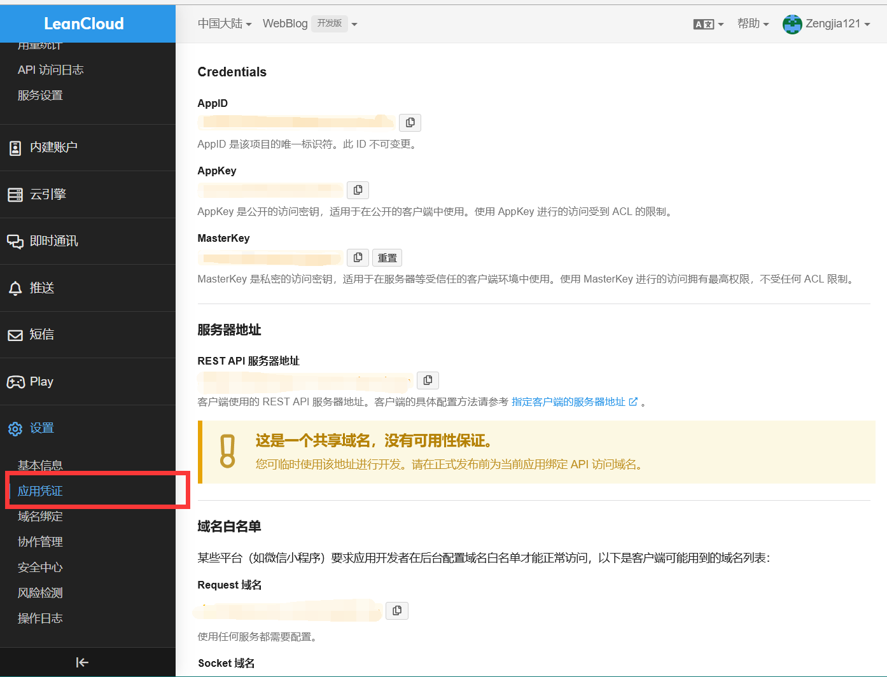

<!-- @format -->

# 博客搭建（七）: 使用 Valine 添加评论功能

`Valine`是一款无后端评论系统，非常适合为静态网站添加评论互动的功能。
本文将说明如何将`Valine`集成到基于 `VitePress`开发的静态博客中，以及一些在集成过程中可能遇到的问题。

- [Valine 官方文档](https://valine.js.org/)
- [LeanCloud 注册地址](https://www.leancloud.cn/)

## LeanCloud 注册

使用`Valine`需要先在`LeanCloud`注册账号，创建应用后可以获得获得对应的`AppID`和`AppKey`


## `Valine`组件配置

在`docs\.vitepress\theme\components`中新创建一个`FooterComment.vue`组件，作为评论区的组件，方便后续放入插槽中
这里要注意一下，`Valine`需要在 window 被定义时才能被加载，不然会报错`ReferenceError: window is not defined`,
所以这里要使用异步去加载（今日踩坑+1）
最终的实现效果可以在下面看到

```ts
<template>
  <div>
    <div id="vcomments"></div>
  </div>
</template>
<script setup lang='ts'>
import { onMounted, ref } from "vue"
import { useData } from "vitepress"
import { usePageId } from "../composables"
const { theme } = useData()
const pageId = usePageId()
const { visitor } = theme.value
onMounted(async () => {
  if (typeof window === "undefined") {
    return
  }
  const Valine = await (await import("valine")).default
  new Valine({
    el: "#vcomments",
    appId: "...",
    appKey: "...",
    placeholder: "说点什么吧...",
    avatar: "hide",
    path: window.location.pathname,
    visitor: true,
    recordIP: true,
    meta: ["nick"],
  })
})
</script>


<style lang='scss' scoped>
#vcomments {
  margin-top: 30px;
  border-radius: 2%;
}
</style>
```
