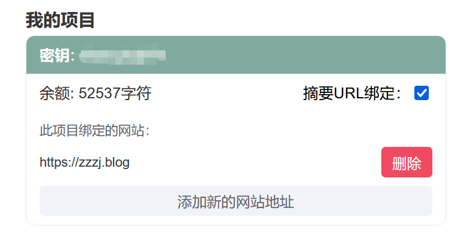

<!-- @format -->

# 使用 TianliGPT 实现自动文章摘要

前段时间网上冲浪的时候看到一个自动 AI 摘要的插件,这两天有空的刚好尝试一下

- [TianliGPT 官网](https://support.qq.com/products/600565/)
- [使用插件源码](https://github.com/zhheo/Post-Abstract-AI)

## 接入 TianliGPT

### api 购买

这里首先需要去官网购买`Key` ,价格是`8.99`元`5`万字符,并且已经请求过的内容再次请求不会消耗`Key`。  
接着在`我的项目`里面绑定对应的域名


### `head.ts`文件设置

接着需要在`head.ts`文件中引入`css`和`js`文件,我这里后面有做一点修改,所以这里引入的是本地的`css`和`js`文件
此外`tianliGPT_postSelector`需要改为模板对应的文章内容所在的元素属性的选择器,不过我感觉`vitepress`应该都是一样的
::: code-group

```ts [本地导入]
  // 添加 Tianli GPT 的本地样式表
  ["link", { rel: "stylesheet", href: "/tianli_gpt/tianli_gpt.min.css" }],
  // 添加 Tianli GPT 的脚本和配置
  [
    "script",
    {},
    `
    let tianliGPT_postSelector = '#VPContent > div > div > div.content > div > main > div > div';
    let tianliGPT_key = '{key}';
  `,
  ],
  ["script", { src: "/tianli_gpt/tianli_gpt.min.js" }],
```

```ts [外部导入]
  // 添加 Tianli GPT 的样式表
  ["link", { rel: "stylesheet", href: "https://ai.tianli0.top/static/public/tianli_gpt.min.css" }],
  // 添加 Tianli GPT 的脚本和配置
  [
    "script",
    {},
    `
    let tianliGPT_postSelector = '#VPContent > div > div > div.content > div > main > div > div';
    let tianliGPT_key = 'dlxecybj9Tx';
  `,
  ],
  ["script", { src: "https://ai.tianli0.top/static/public/tianli_gpt.min.js" }],
```

:::

### `tianli_gpt`微调

其实完成上面的`head.ts`文件导入后,博客已经可以显示出`AI`摘要生成了,但它默认是生成在标题的上方,这样不太好看,所以选择对源码进行一点点的微调,使得这个框插入的地方在我们标题的下面,具体就是找到标题元素`<h1>`,然后在下面插入`AI`摘要

```js
//大约在79行左右
// 找到目标元素中的 <h1> 元素
const h1Element = targetElement.querySelector("h1");
// 将创建的元素插入到 <h1> 元素的下方
if (h1Element.nextSibling) {
  h1Element.parentNode.insertBefore(aiDiv, h1Element.nextSibling);
} else {
  h1Element.parentNode.appendChild(aiDiv);
}
```

然后发现有时候会出现刷新才会显示`AI`摘要的问题,这里应该是因为没有使用`pjax`,所以需要将下面这行注释掉，就可以解决了

```js
document.addEventListener("pjax:complete", function () {
  tianliGPT(true);
});
```

### 文件压缩

微调完之后,将文件变为`.min.js`减少存储空间

1. 安装 `Terser`: 打开终端并运行以下命令来安装 Terser

```sh
npm install terser --save-dev
```

2. 创建一个`minify-js.js`文件,用来压缩`JavaScrip`

```js
const fs = require("fs");
const terser = require("terser");

fs.readFile("tianli_gpt.js", "utf8", (err, js) => {
  if (err) throw err;

  terser
    .minify(js)
    .then((minified) => {
      fs.writeFile("tianli_gpt.min.js", minified.code, (err) => {
        if (err) throw err;
        console.log("JavaScript 文件已压缩");
      });
    })
    .catch((err) => {
      console.error("压缩失败:", err);
    });
});
```

3. 运行压缩脚本

```sh
node minify-js.js
```
