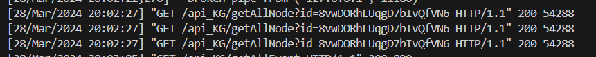
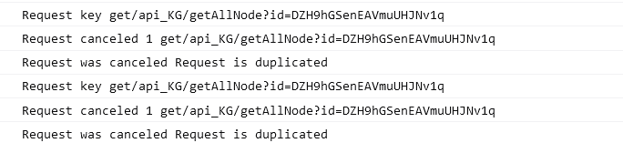
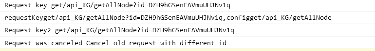

<!-- @format -->

# 使用封装 axios 实现图谱展示请求合并

- [使用封装 axios 实现图谱展示请求合并](#使用封装axios-实现图谱展示请求合并)
  - [需求描述](#需求描述)
  - [尝试一：相同请求直接返回 promise 空对象](#尝试一相同请求直接返回promise空对象)
  - [尝试二：使用 axios CancelToken 阻止相同请求](#尝试二使用axios-canceltoken-阻止相同请求)
  - [尝试三：对比不同请求，删除旧请求，发送新请求](#尝试三对比不同请求删除旧请求发送新请求)
  - [其他设置](#其他设置)
  <!--more-->

## 需求描述

之前使用组件实现了，选择不同图谱进行展示，但点击展示没有进行合并，会导致以下两个问题：

1. 图谱未展示时多次点击按钮会重复调用后端接口
2. 在图谱未展示时切换其他图谱，请求矛盾，只会显示最后返回数据的图谱

所以最好的解决方法是在请求相应器里对请求进行合并，具体的合并需求如下：

1. 连续请求展示相同图谱（具有同样 id）的时候，取消新的请求，只发送旧的请求
2. 请求不同的图谱（具有不同 id）的时候，取消旧的请求，发送新的请求

## 尝试一：相同请求直接返回 promise 空对象

这种方法很简单粗暴，具体步骤：

1. 设置一个 map 对象，然后将每个请求在请求时加入，在响应时删除
2. 将其他请求与 map 对象中的请求进行比对，要是相同请求，则返回空对象

- 代码实现如下：

```TypeScript
// 创建一个 Map 来保存请求和取消令牌
const pendingRequests = new Map()

//创建一个请求和取消令牌的key
function generateReqKey(config: AxiosRequestConfig) {
  const { method, url, params,data } = config
  return [method, url, JSON.stringify(params),JSON.stringify(data)].join("")
}

if (pendingRequests.has(requestKey)) {
  console.log("Request canceled 1", requestKey)
  return Promise.resolve({})
}
```

这样看起来是解决了多个相同请求连续重复的问题，但其实这样并没有拦截请求，后端接收到的请求仍然是一样多的，而且这样无法区别是否请求为不同图谱，遂放弃


## 尝试二：使用 axios CancelToken 阻止相同请求

Axios 具有一个取消令牌（CancelToken）机制，用于取消正在进行的 HTTP 请求。  
一个取消令牌源，包含 token 和 cancel 方法的对象。可以将 token 赋值给请求配置对象的 cancelToken 属性，然后在需要取消请求时，调用 cancel 方法，最后再返回一个空对象回去。
这样就可以实现需求一`取消新的请求，只发送旧的请求`。

- 代码实现如下：

```TypeScript
// 创建一个 Map 来保存请求和取消令牌
const pendingRequests = new Map<string, CancelTokenSource>()

//创建一个请求和取消令牌的key
function generateReqKey(config: AxiosRequestConfig) {
  const { method, url, params } = config
  return [method, url, JSON.stringify(params)].join("")
}
//-----响应拦截器代码-----//
// 如果这个请求已经存在，那么取消新的请求
if (pendingRequests.has(requestKey)) {
  console.log("Request canceled 1", requestKey)
  //创建取消令牌源
  const source = axios.CancelToken.source()
  config.cancelToken = source.token
  //调用cancel取消重复请求
  source.cancel("Request is duplicated")
  return Promise.resolve(config)
}
```



## 尝试三：对比不同请求，删除旧请求，发送新请求

上面已经实现了只发送相同请求的旧请求，而不发送新请求。
但针对不同图谱（同个路径不同 id）则通过遍历当前请求，比较 请求模式+请求路径 来判断当前是否存在旧请求，如果存在则将旧请求取消

- 代码实现如下：

```TypeScript
//-----响应拦截器代码-----//
  // 如果这个请求不存在，那么取消之前不同id的旧请求
    pendingRequests.forEach((value, key) => {
      if (key.startsWith(config.method + (config?.url ?? "").split("?")[0])) {
        // console.log("Request canceled 2", key)
        value.cancel("Cancel old request with different id")
        pendingRequests.delete(key)
      }
    })

  // 添加这个请求到 map 中
  const source = axios.CancelToken.source()
  config.cancelToken = source.token
  pendingRequests.set(requestKey, source)
```



## 其他设置

使用 axios 取消的时候，会在响应拦截器中抛出一个错误，所以要在响应拦截器中添加检查，如果由于请求被取消引起，则返回一个默认的响应，此外，如果出现其他情况导致的请求失败，移除一下这个请求

- 代码如下：

```TypeScript
this.instance.interceptors.response.use(this.handleResponse, (error) => {

  if (axios.isCancel(error)) {
    console.log('Request was canceled', error.message);
    // 返回一个默认的响应
    return Promise.resolve({ data: {} });
  } else {
    // 请求完成后，从 map 中移除这个请求
    const requestKey = generateReqKey(error.config)
    pendingRequests.delete(requestKey)
    // 处理其他错误
    return Promise.reject(error);
  }
});
```
