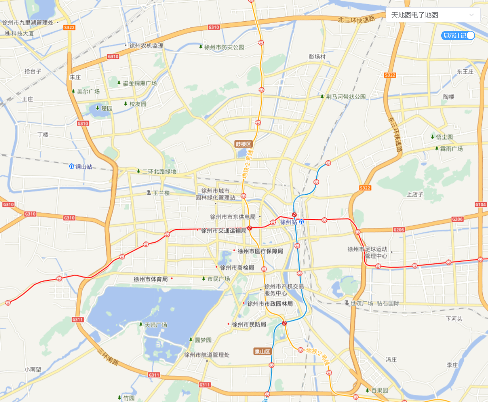

<!-- @format -->

# WebGis 平台搭建(三):各平台瓦片地图加载

## 地图加载初始化

openlayer 的加载感觉和其他插件差不多，需要一个`<div></div>`作为容器，然后加载瓦片层和注记层即可

```ts
//html 界面 需要一个div元素 作为地图的容器
<div
  id="olmap"
  ref="olmap"
  style="width: 100%; height: 100%"></div>;

// ts 程序
const initMap = () => {
  map.value = new Map({
    target: "olmap", // 组件模板中地图容器的 ID
    view: new View({
      center: transform([117.1805, 34.2666], proj, proj_m),
      zoom: 11,
    }),
  });
  mapLayer.value = new TileLayer({
    source: mapSources.tdtwx,
    projection: proj,
  });
  mapLayerlabel.value = new TileLayer({
    source: mapSources.tdtlabelwx,
    projection: proj,
  });
  map.value.addLayer(mapLayer.value);
  map.value.addLayer(mapLayerlabel.value);
};
onMounted(() => {
  initMap();
});
```

## 各平台瓦片地图加载

### 高德地图

- 高德矢量底图

```
http://webst0{1-4}.is.autonavi.com/appmaptile?lang=zh_cn&size=1&scale=1&style=7&x={x}&y={y}&z={z}
```


- 高德路网注记

```
https://webst0{1-4}.is.autonavi.com/appmaptile?lang=zh_cn&style=8&x={x}&y={y}&z={z}
```


- 高德卫星地图

```
http://webst0{1-4}.is.autonavi.com/appmaptile?lang=zh_cn&size=1&scale=1&style=6&x={x}&y={y}&z={z}
```


### 天地图

- 天地图矢量地图

```
矢量地图
https://t0.tianditu.gov.cn/DataServer?T=vec_w&x={x}&y={y}&l={z}&tk={token}

矢量注记
https://t0.tianditu.gov.cn/DataServer?T=cva_w&x={x}&y={y}&l={z}&tk={token}
```



- 天地图卫星地图

```
影像地图
https://t0.tianditu.gov.cn/DataServer?T=img_w&x={x}&y={y}&l={z}&tk={token}

影像注记
https://t0.tianditu.gov.cn/DataServer?T=cia_w&x={x}&y={y}&l={z}&tk={token}
```


### 腾讯地图

- 腾讯矢量地图

```
http://rt0.map.gtimg.com/realtimerender?z={z}&x={x}&y={-y}&type=vector&style=0
```


### OpenStreetMap

这个在`Openlayer`里面，导入`OSM`即可，但加载需要翻墙

```ts
import OSM from "ol/source/OSM";

// 创建OpenStreetMap瓦片图层
const osmLayer = new TileLayer({
  source: new OSM(), // 使用OpenStreetMap源
});
```


