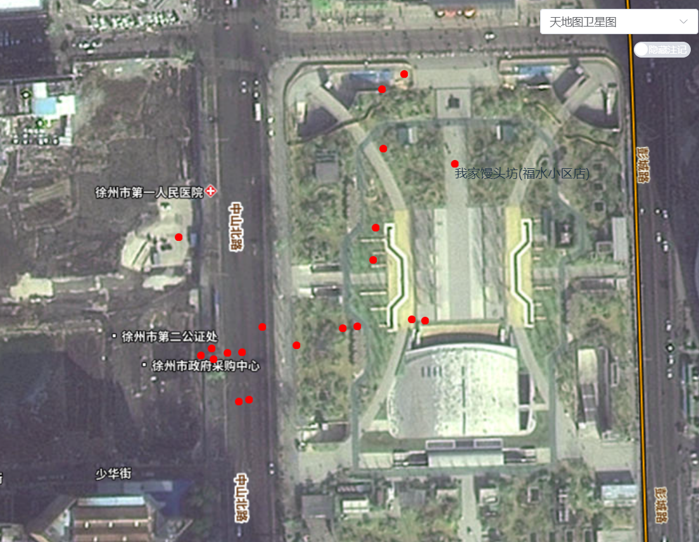
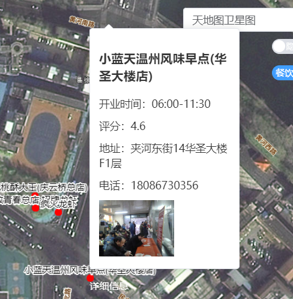

<!-- @format -->

# WebGis 平台搭建(四):地图加载高德 poi 并弹窗展示详细信息

这次是调用高德地图的 API，查找地图中心附近符合类别的`POI`并加载到地图上,实现效果如下：



## 高德 API 调用

从[高德的文档](https://lbs.amap.com/api/webservice/guide/api-advanced/search)里可以查到周边搜索的接口请求如下：

```
https://restapi.amap.com/v3/place/around?location=${location.lng},${location.lat}&radius=1000&types={请求类别}&key={token}

```

## `POI`获取

因此只要在前端获得地图中心点的坐标，再设置请求，就可以获得附近的`POI`,

```ts
let center = map.value.getView().getCenter(); // 获得中心点坐标
let res = await axios.get(
  `https://restapi.amap.com/v3/place/around?location=${center[0]},${center[1]}&radius=1000&types=${type}&key=${token}`
); //获得附近的POI
console.log(res.data);
markData = res.data;
```

## `POI`加载

创建一个带有特定位置和样式的`Feature`对象，添加到`VectorSource`中,与一个`VectorLayer`关联，添加到地图上，从而在地图上显示标记

```ts
// 在循环外部创建 VectorSource 和 VectorLayer
const vectorSource = new VectorSource();
const vectorLayer = new VectorLayer({
  source: vectorSource,
});

// 遍历标记数据，为每个标记创建 Feature 并添加到 VectorSource
markData.pois.forEach((item) => {
  const coords = item.location.split(",").map(Number); // 简化坐标解析
  const marker = new Feature({
    geometry: new Point(transform(coords, proj, proj_m)),
    properties: {
      name: item.name,
      ...item,
    },
  });

  // 启用并设置标记样式，包括图像和文本
  marker.setStyle(
    new Style({
      image: new CircleStyle({
        radius: 5,
        fill: new Fill({
          color: "red",
        }),
      }),
      text: new Text({
        text: item.name,
        font: "12px Calibri,sans-serif",
        fill: new Fill({
          color: "#000",
        }),
        stroke: new Stroke({
          color: "#fff",
          width: 2,
        }),
        offsetX: 0,
        offsetY: -10, // 根据需要调整文本偏移量
      }),
    })
  );

  vectorSource.addFeature(marker); // 将标记添加到源中
});
map.value.addLayer(vectorLayer);
```

## POI 弹窗展示

使用`element-plus`的`el-popover`和`OpenLayer`的`popup`完成的
一开始想移动到对应`marker`的时候就展示弹窗，但发现好像没办法捕获到对应的`marker`，只能移动到对应`marker`的时候弹出`popup`，再由`popup`跳转到`el-popover`

- `popup`部分

```ts
popup.value = new Overlay({
  element: document.getElementById("popup"),
  autoPan: true,
  autoPanAnimation: {
    duration: 250,
  },
});
map.value.addOverlay(popup.value);
map.value.on("pointermove", function (event) {
  // 检查鼠标位置下是否有feature
  if (map.value.hasFeatureAtPixel(event.pixel)) {
    map.value.forEachFeatureAtPixel(event.pixel, function (feature) {
      properties = feature.getProperties().properties; //这里创建了一个响应式变量，便于弹窗信息的显示
      console.log(properties);
      const coordinates = feature.getGeometry().getCoordinates();
      popup.value.setPosition(coordinates);
      document.getElementById("popup-content").innerHTML = "详细信息";
      return true; // 停止遍历更多的 feature
    });
  }
});
```

- `el-popover`部分

只要在`<template #reference>`部分放入`<div id="popup-content"></div>`就可以了

```html
<div
  id="popup"
  class="ol-popup">
  <a
    href="#"
    id="popup-closer"
    class="ol-popup-closer"
    @click="closePopup"></a>
  <el-popover
    placement="top-start"
    :width="200"
    trigger="hover">
    <div
      class="info"
      v-if="properties">
      <h3>{{ properties.name }}</h3>
      <p>开业时间：{{ properties.biz_ext.open_time }}</p>
      <p>评分：{{ properties.biz_ext.rating }}</p>
      <p>地址：{{ properties.address }}</p>
      <p>电话：{{ properties.tel }}</p>
      
    </div>
    <p v-else>没有数据</p>
    <template #reference>
      <div id="popup-content"></div>
    </template>
  </el-popover>
</div>
```

- 最终效果

  
