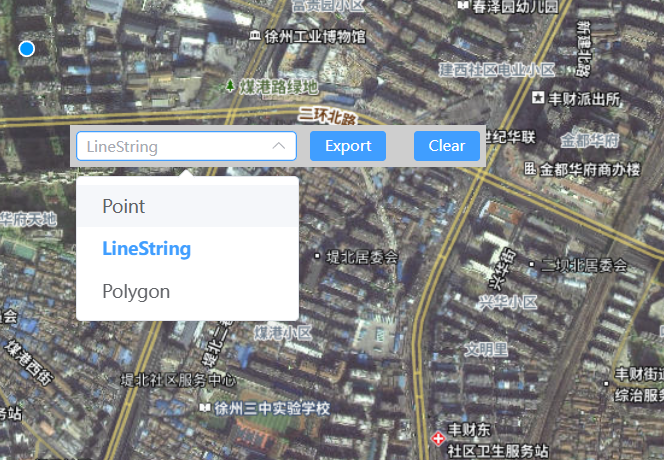

<!-- @format -->

# WebGis 平台搭建(五):组件拖曳实现

这次想实现一个可以拖动的编辑栏，但是之前也没有使用类似的插件做布局，所以还是自己手撸一个简单方便点


## 实现代码

在`main.ts`中加入下列代码，注册一个自定义指令，计算移动之后元素与左上角的位置，重新设定元素位置，使用了`v-draggable`指令的元素都变得可拖动

```ts
//注册了一个新的自定义指令
app.directive("draggable", {
  beforeMount(el) {
    // 设置元素的鼠标光标为移动图标
    el.style.cursor = "move";
    el.onmousedown = function (e) {
      // 计算鼠标点击位置与元素左上角的水平与垂直距离
      let disX = e.clientX - el.offsetLeft;
      let disY = e.clientY - el.offsetTop;
      // 当鼠标移动时，更新元素的位置
      document.onmousemove = function (e) {
        // 根据鼠标的新位置计算元素的新左边距
        let x = e.clientX - disX;
        // 根据鼠标的新位置计算元素的新顶边距
        let y = e.clientY - disY;
        // 更新元素的左边距，使元素移动到新位置
        el.style.left = x + "px";
        // 更新元素的顶边距，使元素移动到新位置
        el.style.top = y + "px";
      };
      document.onmouseup = function () {
        document.onmousemove = document.onmouseup = null;
      };
    };
  },
});
```

<!-- @format -->
