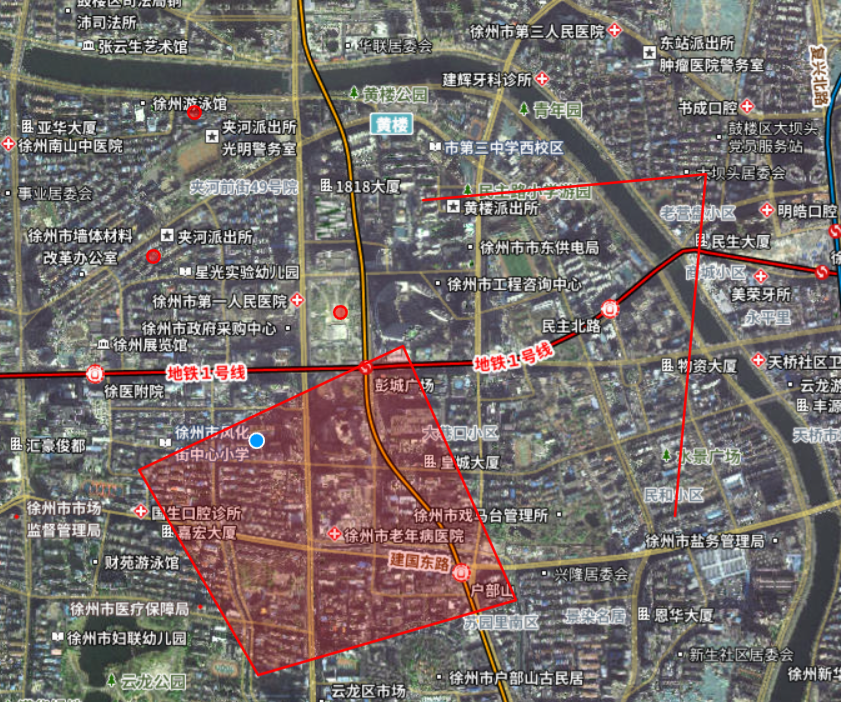

<!-- @format -->

# WebGis 平台搭建(六):点线面绘制及切换

这次实现像`ArcGis`那样的点线面的矢量绘制，并且可以在绘制的时候进行切换绘制的类型


## 具体实现

### 矢量图层与绘制交互图层创建

首先，需要创建下面三个要素：

1. 一个矢量源`vectorSource`,用于存储绘制的矢量（全局变量）
2. 一个矢量图层`vectorLayer`,用于展示绘制好的矢量
3. 一个绘制交互图层`drawInteraction`,用于进行绘制（全局变量）

```ts
// 创建矢量图层用于显示绘制的几何图形
vectorSource.value = new VectorSource();

const vectorLayer = new VectorLayer({
  source: vectorSource.value,
  style: style, // 应用样式
  // zIndex 用于控制图层的优先度，调高点不然切换图层的时候会被覆盖
  zIndex: 5,
});
map.value.addLayer(vectorLayer);

// 添加绘制交互
drawInteraction.value = new Draw({
  source: vectorSource.value,
  // 根据需要更改为 'Point', 'LineString', 'Polygon'
  type: currentDrawInteraction.value,
});
map.value.addInteraction(drawInteraction.value);
```

### 绘制类型的切换

上述三个图层创建好后，只能绘制一种类型的对象，而这里想实现的是可以选择点线面类型的切换，这里设置了一个属性`drawInteraction`，用于记录当前选择的绘制类型是什么，
接着再使用`watchEffect`监控值的变换，添加新的绘制类型图层，实现绘制类型的变化

```ts
watchEffect(() => {
  // 确保 map.value 不为 null
  if (map.value) {
    //如果已经存在绘制交互，先从地图上移除
    //否则会重叠，导致无法切换
    if (drawInteraction.value) {
      map.value.removeInteraction(drawInteraction.value);
    }
    // console.log(currentDrawInteraction.value);
    // 根据当前的 currentDrawInteraction 值创建新的绘制交互
    const newDrawInteraction = new Draw({
      source: vectorSource.value,
      type: currentDrawInteraction.value, // 确保使用 .value 访问响应式引用的值
    });

    // 将新的绘制交互添加到地图上
    map.value.addInteraction(newDrawInteraction);

    // 更新 drawInteraction 变量以便下次更改时可以移除它
    drawInteraction.value = newDrawInteraction;
  }
});
```

<!-- @format -->
