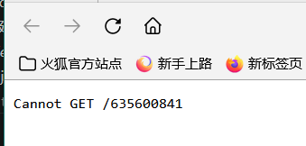
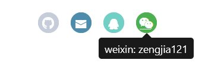

<!-- @format -->

# yillia 实现 QQ 微信弹出信息 而不是跳转页面

原本的 yillia 下方的 subNav 是默认直接跳转，  

这导致我的 wx 和 qq 点击后会跳转到一个非常丑的页面（这样显得我很不专业）  
所以希望实现功能: **wx 和 qq 的按钮悬浮显示设置中的内容**

<!--more-->

具体步骤如下：

1. 首先在 layout/layout.ejs 中导入所需的组件,并进行初始化
   ```JavaScript
     <!-- 引入 jQuery 和 Bootstrap 的 JavaScript 文件 -->
   <script src="https://code.jquery.com/jquery-3.3.1.slim.min.js"></script>
   <script src="https://cdnjs.cloudflare.com/ajax/libs/popper.js/1.14.7/umd/popper.min.js"></script>
   <script src="https://stackpath.bootstrapcdn.com/bootstrap/4.3.1/js/bootstrap.min.js"></script>
   <!-- 初始化 tooltip 组件 -->
   <script>
    $(function () {
      $('[data-toggle="tooltip"]').tooltip()
    })
   </script>
   ```
2. 定位到 subnav 的具体位置,在 layout/\_parital/left-col.esj 中第 30 行左右
3. 修改 div social 中的对应代码，将 qq 和 wx 的部分修改,在相应的元素上添加 data-toggle="popover" 属性，代码如下

```JavaScript
				<% for (var i in theme.subnav){ %>
					<% if (i === 'qq' || i === 'weixin') { %>
						<a class="<%= i %>" href="#" data-toggle="tooltip" data-placement="bottom" title="<%= i %>: <%= theme.subnav[i] %>"><i class="icon-<%= i %>"></i></a>
					<% } else { %>
						<a class="<%= i %>" target="_blank" href="<%- url_for(theme.subnav[i]) %>" title="<%= i %>"><i class="icon-<%= i %>"></i></a>
					<% } %>
				<%}%>
```

现在就可以悬浮显示 qq 和 wx 了

